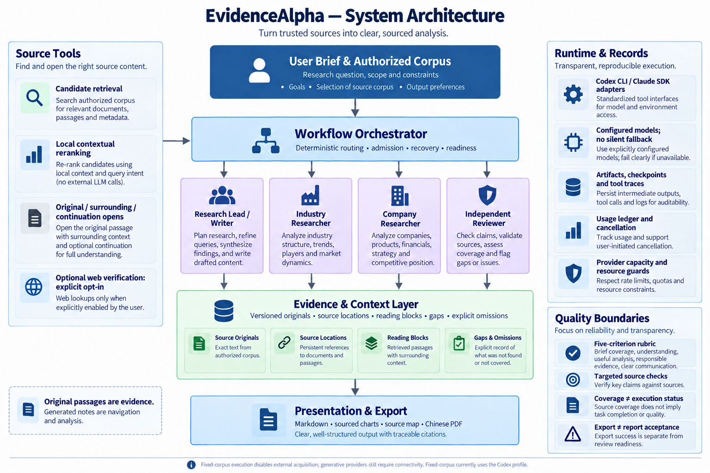
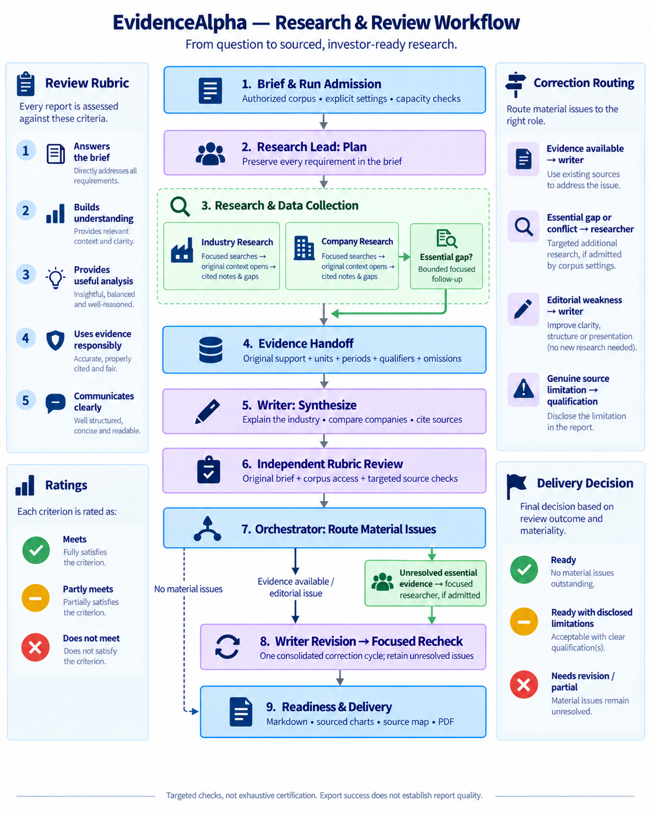

# EvidenceAlpha

**Turn a research brief and original sources into a cited industry and company
report.**

EvidenceAlpha is a Python command-line application for investors who understand
investing but are new to an industry. It coordinates research, writing and
independent review to explain the value chain, technology, commercialization,
company economics and risks. Reports can include company comparisons, sourced
charts, relationship diagrams and Chinese-capable PDF output.

Original passages and source locations accompany findings through research,
writing and correction. Generated notes help organize the work; citations remain
anchored to the original material.

[How it works](#how-it-works) · [Quick start](#quick-start-no-model-calls) ·
[Live research](#run-live-research) · [Review a report](#review-a-report) ·
[Documentation](docs/README.md)

## What the project provides

| Input | Work performed | Output |
| --- | --- | --- |
| Research question, scope and constraints | Planning and specialist industry/company research | A structured explanation that addresses the brief |
| Authorized source corpus | Search, local reranking and original-context reading | Cited findings with source locations and disclosed gaps |
| Explicit model and execution settings | Synthesis, independent review and a bounded correction cycle | Markdown, PDF, sourced figures and source mapping |
| Saved stage artifacts | Inspection, compatible replay and checkpoint recovery | Traceable execution, usage and delivery records |

The current interface is the CLI. The proposed visual workspace is described in
[the Studio design](docs/redesign/workflow-studio/DESIGN.md); it is not an
implemented UI. Research results can retain gaps and factual errors. Readiness,
source coverage and successful file export are reported separately.

## How it works

### Architecture



The **workflow orchestrator** controls stage admission, routing, recovery and
completion. Four roles share the same source and evidence infrastructure:

| Role | Responsibility |
| --- | --- |
| Research Lead / Writer | Interpret the brief, plan work, synthesize findings, create figures and revise the report |
| Industry Researcher | Explain industry structure, technology, value chains and commercial drivers |
| Company Researcher | Investigate company products, financials, relationships and competitive position |
| Independent Reviewer | Assess the report against the brief and check pivotal claims against original sources |

Source tools retrieve candidates, rerank them locally and open original passages
with surrounding or continuation context. The evidence layer preserves source
identity, units, periods, qualifiers and omissions for downstream stages. Runtime
adapters isolate provider calls; artifacts and usage records make the work
inspectable. The architecture diagram is conceptual, not a concurrency schedule.

Optional **hybrid retrieval** combines lexical search with a local Chroma vector
index before reranking. Its index references original spans; generated summaries
do not become evidence. See the [retrieval implementation and setup](docs/redesign/chroma-source-index/IMPLEMENTATION.md).

### Research and review workflow



1. **Define and admit the run.** Load the brief, corpus and explicit settings;
   check provider capacity and required local resources.
2. **Plan and research.** Assign relevant specialist work, search for evidence,
   open originals and record unresolved questions. Essential gaps may receive a
   bounded follow-up.
3. **Synthesize.** Carry original support into the writer's context and produce
   the report, comparisons and figures.
4. **Review independently.** Assess brief coverage, understanding, useful analysis,
   responsible evidence use and clear communication, with targeted source checks.
5. **Correct and deliver.** Route supported factual or editorial fixes to the
   writer; unresolved essential evidence may require focused research. At most
   one consolidated revision and one focused recheck follow the review.

The workflow retains unresolved material issues when resources or sources cannot
resolve them. A retrieval miss does not establish that the full source lacks a
fact. The [module guide](docs/ARCHITECTURE.md) explains implementation boundaries.

## Quick start: no model calls

Use Python **3.11 or 3.12** and run commands from the repository root. For a new
checkout:

```bash
git clone https://github.com/Jer3myYu/EvidenceAlpha.git
cd EvidenceAlpha
python3.12 -m venv .venv
.venv/bin/pip install -e '.[dev]'
.venv/bin/python -m evidencealpha --help
```

Reuse an existing configured environment when working in an established checkout.
Graphviz's `dot` executable supports relationship-diagram rendering. Chinese PDF
output needs compatible installed fonts, preferably Noto or Source Han.

Run the versioned manufacturing fixture into a **new output directory**:

```bash
.venv/bin/python -m evidencealpha run \
  --fixture tests/fixtures/redesign/manufacturing.json \
  --output data/redesign/my-fixture-run

.venv/bin/python -m evidencealpha show-run data/redesign/my-fixture-run
```

Open `data/redesign/my-fixture-run/reports/report.md` and the generated PDF to
inspect the result. The fixture supplies deterministic source and role outputs;
it exercises orchestration and rendering without generative provider calls.
It does not measure autonomous research quality.

## Run live research

Live fixed-corpus research uses your local sources **and makes generative provider
calls**. The current fixed-corpus path uses the Codex profile. A clone does not
include the maintained installation's corpus, model weights, environments,
authentication or saved reports.

### Prepare the inputs

1. Install the local retrieval dependencies in your chosen environment:
   `.venv/bin/pip install -e '.[retrieval]'`.
2. Configure the supported provider runtime through its normal login flow and
   supply an already installed reranker snapshot with an explicit revision.
3. Prepare an EvidenceAlpha source-store corpus. The `corpus` field expects the
   captured source-store structure, not a directory of unparsed PDFs. For custom
   ingestion, use [`SourceStore.ingest`](src/evidencealpha/documents.py), which
   captures original bytes, parsed text and source locators.
4. Copy the [execution example](configs/photomask.fixed-corpus.example.json) to a
   local file and adapt it to your question and available assets:

```bash
mkdir -p data/local-configs
cp configs/photomask.fixed-corpus.example.json data/local-configs/my-research.json
```

Edit these fields before launching:

| Field | What to set |
| --- | --- |
| `brief.text`, `brief.scope` | Your research question, audience, scope and limitations |
| `required_scope`, `required_research_roles`, `planning_constraints` | Requirements and specialist work appropriate to your brief; replace the example's company-specific entries |
| `corpus` | Path to your prepared source store |
| `settings.reranker_path`, `settings.reranker_revision` | Installed local reranker snapshot and matching revision |
| `settings.runtime_model`, `settings.reviewer_model` and effort fields | Explicit models supported by your configured provider |
| `settings.command_seconds`, `settings.command_calls` | Overall deadline and optional call ceiling |
| `settings.information_cutoff`, `acceptance_provenance` | Relevant cutoff and an accurate description of this run |

Use absolute corpus/model paths when copying the example: relative paths resolve
from the execution JSON's directory. `settings.search_env_file` resolves from the
working directory. Keep credentials in local configuration, outside Git.

The shared example records `gpt-5.6-sol` for research/writing and `gpt-6-astra` for
review/recheck. These are explicit example requests, not a guarantee of model
availability or reported effective identity. Choose settings appropriate to your
installation and authorized run policy. There is no implicit model download or
paid-provider fallback.

### Launch and inspect

After configuring your local execution file:

```bash
.venv/bin/python -m evidencealpha fixed-corpus \
  --execution data/local-configs/my-research.json \
  --output data/redesign/my-research-run
```

The maintained local installation can use `runtime/environment/bin/python` in
place of `.venv/bin/python`, with `PYTHONPATH="$PWD/src"` to select this checkout's
code. That environment link is machine-specific and is not supplied by a clone.

Inspect the printed status and `data/redesign/my-research-run/command-result.json`,
then open the report paths recorded by the run. Overall deadline, optional call
ceiling, provider capacity, watchdogs, cancellation and hardware guards constrain
execution. Some older time/token fields are guidance or telemetry; see
[budget behavior](docs/redesign/coherent-retrieval/BUDGET-SIMPLIFICATION.md) and
[settings definitions](src/evidencealpha/config.py).

External source acquisition is disabled by `fixed-corpus`. Targeted web
verification requires both `settings.web_verification: true` and the explicit
`verify-report` command, with the same `--execution` and `--output` arguments.
Captured web originals remain distinguishable from the initial corpus.

For optional hybrid retrieval, install the `vector-index` extra and follow the
[index configuration and build instructions](docs/redesign/chroma-source-index/IMPLEMENTATION.md).
Build into a new directory and set `settings.vector_index_path` in the execution
file. Corpus changes require a new compatible index snapshot.

## Review a report

A useful review checks the deliverable and its evidence alongside execution
status:

1. **Read the original brief, then the report.** Check whether it explains the
   requested industry and makes meaningful company comparisons.
2. **Inspect key citations and figures.** Follow source mapping to original
   passages. Check financial units, periods and business scope, and distinguish
   plans, sampling, qualification and commercial production.
3. **Read the independent review and recheck.** Each of the five criteria receives
   Meets, Partly meets or Does not meet. Inspect examined scope, material findings,
   resolved issues and remaining qualifications.
4. **Check delivery status.** Live results distinguish `execution_status`,
   `coverage_status`, `review_status`, `readiness`, `unresolved_issues` and
   `export_status`. An exported PDF alone does not establish report acceptance.
5. **Check provenance.** Identify the recorded code/settings, source corpus,
   requested/reported models and whether stages were live, fixture-driven,
   replayed or recovered.

Runs retain stage inputs/outputs, original evidence, tool traces, usage and report
artifacts. `show-run` provides a compact saved-manifest summary. `render` exports
saved Markdown without research; it writes export artifacts. Fixture `resume`
and `replay-stage` differ from live `--continue-existing` checkpoint continuation.
Use command-specific `--help` and preserve original runs when replaying or
recovering work.

### Recorded results and limits

The [documented photomask delivery](docs/redesign/presentation-live-20260912/HANDOFF.md)
completed fresh research and corrective review with engineering recovery. Its
recheck found it **ready with disclosed limitations**, with partial coverage.
It was not an uninterrupted run of the final code, and it does not establish
reliability across unseen industries.

The separate [hybrid retrieval evaluation](docs/redesign/chroma-source-index/LIVE-RESULTS.md)
found **4 Useful / 3 Partial** substantive answers for hybrid retrieval versus
**3 Useful / 4 Partial** for the lexical baseline, with higher latency. Its target
of five Useful answers was not met. The older **9 pass / 7 partial** benchmark is
a distinct historical result. Ongoing live tests are separate from these records.

Saved reports and datasets under `data/` are ignored local assets and are not
hosted on GitHub. The linked engineering records describe what was actually
measured and where local artifacts were saved.

## Repository guide and development

| Path | Purpose |
| --- | --- |
| [`src/evidencealpha/`](src/evidencealpha/) | Active CLI, workflow, retrieval, provider adapters, export and role prompts |
| [`tests/redesign/`](tests/redesign/) | Focused regression checks |
| [`tests/fixtures/`](tests/fixtures/) | Versioned deterministic examples |
| [`configs/`](configs/) | Shareable execution examples |
| [`docs/README.md`](docs/README.md) | Documentation navigation |
| [`docs/ARCHITECTURE.md`](docs/ARCHITECTURE.md) | Module responsibilities and evidence flow |
| [`docs/diagrams/`](docs/diagrams/) | Illustrated PNGs and editable topology references |
| `data/`, `runtime/`, `.venv/`, `.local/`, `worktrees/` | Ignored local sources, outputs, environments and workspace assets |

For code review, start with the module guide, then inspect the relevant module,
role prompt and focused tests. Development checks use the declared `dev` extras:

```bash
.venv/bin/python -m pytest tests/redesign
.venv/bin/python -m black --check src/evidencealpha tests/redesign
.venv/bin/python -m pylint --jobs=1 src/evidencealpha tests/redesign
```

Prefer focused checks for changed behavior. Use typed public APIs, Google-style
Python/docstrings and 80-column Black formatting. Fixture checks establish
contracts; live research quality requires separate evidence.

The [redesign package](docs/redesign-package/00-START-HERE.md) preserves the original
staged implementation policy. Later run-specific changes are recorded in their
handoffs. Historical instructions and launch commands are provenance, not steps
required to read or try this project. The [layout receipt](docs/REORGANIZATION-RESULTS-20260912.md)
explains preserved local assets; Git does not back up ignored files.
