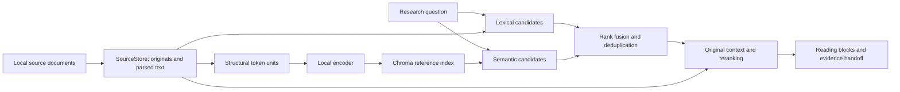

# Source storage and retrieval

## Responsibilities

The filesystem SourceStore holds original bytes, canonical extracted text,
versions and source/chunk locations. Chroma is an optional **derived index** of
embeddings and immutable references, without another full document-text copy.
`units.json` maps search units to original spans; `ready.json` binds the corpus,
model/tokenizer artifacts, chunk policy and stored vectors.



Without an index path, the existing lexical-candidate path remains selected.
Old databases are not selected or migrated implicitly. An immutable snapshot
must match its corpus; new/changed sources require a new explicit build.

## Chunking and selection

- `structural-token-units-1` packs small elements within the same source,
  section, page and kind, up to the configured encoder token size (default 384,
  including prefix/special tokens). Headings and tables stay separate.
- Oversized paragraphs prefer sentence boundaries; oversized sentences use
  explicit lossless character fragments. This is structural/token chunking,
  not LLM semantic segmentation.
- Table rows may repeat the first original row for navigation when capacity
  permits. This does not certify header association or units. Original pages
  and continuation opens remain available.
- The installed multilingual E5 implementation uses query/passage prefixes,
  masked mean pooling, L2 normalization and CPU float32. Actual encoder inputs
  are checked against capacity rather than silently truncated.
- Lexical and dense branches nominate candidates. Equal-weight reciprocal-rank
  fusion (constant 60) deduplicates original anchors into the configured pool.
  The normal contextual BGE reranker then orders candidates for reading.
- Candidate depth, returned-block count and window size are retrieval parameters,
  not measures of sufficient question coverage. Researchers must investigate
  essential gaps, and a missing result is not proof of document-wide absence.

Typical evaluated settings used 64 candidates, six returned reading blocks and
8,000-character reading windows. Richer original context and direct opens support
interpretation. Cross-stage writing selection uses payload capacity and original
support requirements, not a separate first-N passage cap. Mandatory evidence
that cannot fit causes an explicit admission failure.

## Build a local index

Install the optional packages into the chosen isolated environment:

```bash
.venv/bin/pip install -e '.[vector-index,retrieval]'
```

Provide installed encoder/reranker snapshots and full matching revisions; these
commands do not download model weights. Copy and edit the settings template:

```bash
mkdir -p data/local-configs
cp configs/retrieval.example.json data/local-configs/retrieval.json

.venv/bin/python -m evidencealpha \
  --config data/local-configs/retrieval.json index-corpus \
  --corpus /absolute/path/to/prepared-corpus \
  --output /absolute/path/to/new-index
```

The global `--config` precedes `index-corpus`. Use absolute paths inside this
settings file and a new output directory. Index construction uses local neural
inference and can take substantial time even without generative calls.

To use the index for a report, copy the encoder/model settings into the execution
file's `settings` object and set `vector_index_path` to the new index. Keep the
corpus identical to the snapshot. See [Setup](SETUP.md) for the normal report
command. `dense_python` must identify the environment containing Chroma and the
encoder dependencies; do not replace a virtualenv interpreter path with its
resolved system binary.

## Performance and limits

Every uncached search launches an encoder worker and closes it before launching
the reranker worker. Both initialize/load per uncached search. Traces separate
preparation, snapshot verification, initialization, embedding, index query,
reranker scoring, total latency and sampled memory. A warm resident-model
benchmark is not representative of that path.

The maintained evaluations used CPU float32, four Torch threads, one local neural
worker at a time and an 8 GiB sampled worker RSS guard. Search watchdogs include
preparation and scoring. Memory sampling is not an instantaneous peak measurement
or a guarantee for total system memory across unrelated processes.

Hybrid retrieval is operational but has shown higher latency and incomplete
answers. Incremental indexing and global admission across multiple application
processes are not implemented. Reading completeness, candidate coverage, ranking
quality and exact writing preservation are assessed separately. See
[Evaluation](EVALUATION.md); no source-count or top-K accuracy claim is made.
