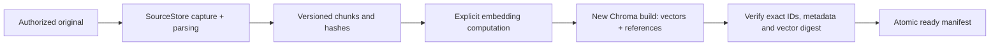
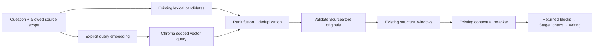

# Filesystem + Chroma: source-preserving retrieval

Status: branch experiment, not a replacement of the evaluated retrieval default.
Base: `560662e`. Historical corpora, Chroma databases and runs remain unchanged.

## Research basis and decision

Use the filesystem as the authoritative evidence store and Chroma as a rebuildable
index of vectors and references. The components cooperate through immutable chunk
identity, not duplicate editable copies of reports and evidence.

Three documented implementations support the separation:

1. Chroma explicitly supports vectors/metadata without document text, resolving
   externally stored documents by ID. This avoids a second original-text store.
   [Chroma adding data](https://docs.trychroma.com/docs/collections/add-data).
2. LangChain's ParentDocumentRetriever searches small chunks, then resolves their
   parents for richer reading context. Its LocalFileStore provides persistent
   filesystem byte storage. The benefit is separating search granularity from
   reading granularity. We reuse the pattern, not LangChain dependencies or its
   whole-parent policy: our existing structural windows preserve bounded context.
   [ParentDocumentRetriever](https://reference.langchain.com/python/langchain-classic/retrievers/parent_document_retriever/ParentDocumentRetriever),
   [LocalFileStore](https://docs.langchain.com/oss/python/integrations/stores/file_system).
3. LlamaIndex separates document, vector and index stores through StorageContext.
   The benefit is independent storage responsibilities and persistence. Its default
   example is not evidence of Chroma-specific production performance.
   [Storage customization](https://developers.llamaindex.ai/python/framework/module_guides/storing/customization/).

These are implemented library patterns, not claims about undisclosed production
users or performance on our corpus. Chroma's Cloud Search API cannot be assumed
available locally; local dense queries and application rank fusion are sufficient.
[Search API](https://docs.trychroma.com/cloud/search-api/overview).

## Ownership and minimal redundancy

| Owner | Canonical data | What other components retain |
| --- | --- | --- |
| SourceStore | Original bytes, canonical text, exact chunk spans and source metadata | Source ID, chunk ID and hashes |
| Chroma collection | Embedding vectors, chunk IDs and minimal binding metadata | Collection/build identity and query result IDs/ranks |
| Index manifest | Corpus metadata hashes, embedding signature, dimension, metric, record count/digest, readiness | Manifest hash; no copied documents or vectors |
| Existing stage artifacts | Answers, selected originals, gaps, exact requests and review | References/projections for Studio |
| Ledger | Actual execution usage | Read-only usage views |

Query hits are resolved through SourceStore and validated before entering normal
reading. A database string never overrides an original. Evidence copies required
for exact requests and portable recovery remain intentional; no global storage
migration or stage-format rewrite accompanies this experiment.

## Preparation and publication

Build into a new directory with exclusive creation; never open or migrate old
Chroma paths. An incomplete directory without a ready manifest cannot serve queries.
No cross-store transaction is assumed: immutable sources plus an atomic readiness
record form the publication boundary. Crash residue remains diagnostic and requires
a new additive build. No in-place delete/update operation is exposed.

The signature covers embedding model/revision, dimensions, normalization, metric
and input-construction policy. Corpus identity includes complete source metadata
hashes (parser/chunker/block spans included). Model dimensions alone are insufficient.
The prototype accepts explicitly supplied vectors and signature; it cannot prove
which model produced caller-supplied vectors. A live embedder must attest those
inputs before production admission.

Validate finite, nonzero vectors and one vector per canonical chunk. Persist an
integrity digest over Chroma's stored float representation and metadata. On open,
validate signature, corpus and index contents. Revalidate original bindings on
query. Under this small-corpus prototype, full index integrity scans are deliberate;
large-corpus incremental validation is not yet implemented or benchmarked.

Generated navigation summaries stay separate, optional and non-evidence. Initial
embedding inputs should be original chunks, with a declared policy for structural
headers. No silent token truncation: oversized chunks require explicitly versioned
embedding units mapped to original spans before a live build. The prototype's
one-vector-per-chunk contract does not implement such splitting.

## Query and evidence flow

Use equal-weight reciprocal-rank fusion, constant 60, deterministic source/chunk
tie-breaking and a fixed merged candidate cap. This is an experimental engineering
choice, not a tuned quality conclusion. Never add vector distances to lexical scores.
Both branches obey source scope before top-k. The index corpus must exactly match
the authorized store: mismatches fail rather than silently mixing sources. External
source additions need a new admitted build; online incremental updates are deferred.

Dense results contain source/chunk IDs, distance, rank and build identity. Existing
retrieval traces carry branch attribution without another Studio trace database.
Exact opens continue to bypass vector/neural work. Dense storage alone does not
establish semantic recall; reranking cannot restore excluded evidence.

## Prototype and promotion boundary

Implement a small optional Chroma index module and an injected candidate-provider
boundary in the existing Retriever. Default behavior remains identical. A runnable
local experiment uses real persistent Chroma and deterministic vectors plus an
injected reranker. It exercises storage/reopen/query/fusion/original reading and
settlement; it is not semantic model evaluation or autonomous research.

The prototype does not enable hybrid mode through the live fixed-corpus settings.
Before promotion: select an installed compatible Chinese embedding model, pin and
verify its revision/input capacity, implement supervised embedding/index operations
with cancellation/RSS protection, wire immutable index settings into normal execution
freeze, and measure actual retrieval quality and CPU/memory. Native Chroma calls
are synchronous here; cooperative checks cannot interrupt a hung database operation.
Use an outer process timeout for the trial. No broad benchmark or report rerun is
required to prove this storage contract.

Focused checks: reopen without document text in Chroma; reject source/index/signature
changes and incomplete build; enforce source scope; preserve exact spans through
normal Retriever and StageContext; preserve failed attempts. Replay is labelled as
plumbing. Inspect preexisting environments only; no automatic downloads or default
Chroma embedding functions. Prototype uses installed Chroma 1.1.1 explicitly with
telemetry disabled. Pin this experiment's optional dependency separately.

## Studio

Expose preparation and retrieval as nested diagrams. Show original/source version,
index readiness, signature, candidate branch/rank, merged selection, returned
context and settled/writing support. Show source context and its coverage separately.
Historical runs without dense observations remain lexical-only. One record serves
multiple views; no duplicate vector store, corpus or ledger belongs to Studio.
