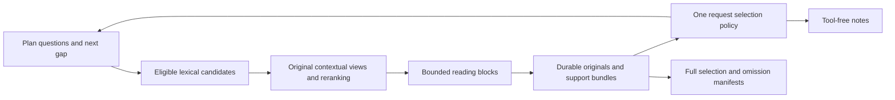

# Coherent retrieval and evidence handoff

Design prepared 2026-09-11. **Proposed implementation; nothing implemented or
evaluated in this session.** The immediate authorization is design/documentation
only. This document is the next work item, not a restart of Stage 2 or an old
campaign. The supplied
[fresh-session handoff](../../../tmp/9-11-26/EvidenceAlpha_Fresh_Session_Handoff.md)
controls this session; the roles, provenance and numerical-policy principles in
[the redesign package](../../redesign-package/00-START-HERE.md) remain applicable.
The user's prohibition on test reruns overrides routine code-check instructions
for this documentation session.

## 1. Verified baseline and repository boundary

| Item | Inspected state |
|---|---|
| Shared checkout and document destination | `/home/cobot/cobot_storage/webproject/EvidenceAlpha` |
| Shared branch / HEAD | `research-quality-upgrade` / `5715b5a`; ahead of its recorded tracking branch by 14 commits |
| Isolated worktree | `/home/cobot/cobot_storage/webproject/EvidenceAlpha-company-stage-20260911` |
| Isolated branch / HEAD | `company-stage-timing-navigation` / `e80e1415ea3fd161503ea3532e7b5ec9cdaeaef9`; clean at inspection |
| Runtime correction | `ea818b808895b0ba54a01627874d21da2da77f41` |
| Completed baseline | `company-stage-corrected`, company stage `583a294897d1` |
| Artifact location | Shared checkout: `data/redesign/company-stage-corrected/`; absent from isolated worktree |
| Current result documentation | Shared, untracked `docs/redesign/company-stage-corrected/RESULTS.md`; no later documentation commit in the isolated worktree |

The shared checkout already had ten modified tracked files: six runtime files
(`budget`, `config`, `documents`, `providers`, `tools`, `workflow`), two domain
fixtures, and `test_completion_phases.py` / `test_focused_correction.py`.
Pre-existing untracked work included allocation/navigation documentation,
autonomous-corpus-eval, bm25-comparison, company-stage-corrected,
execution-readiness, existing-corpus-campaign-2, report-editorial,
report-production, retrieval-reference-review, transition-test results, and
`test_allocation_and_navigation.py`. None is part of this document's changes.
No reset, branch switch, source movement, commit, push or merge was needed.

Read-only comparison found shared `documents.py`, `stage_context.py`,
`config.py`, `tools.py`, `workflow.py` and `providers.py` identical to e80e141.
This does not make shared HEAD the evaluated commit. Implementation should use
a new branch/worktree from the verified tested code, then reconcile any later
user changes explicitly. Retired code remains recoverable at
`3abe9692f3b5f3bbe20390a8d8971af994d3f07b`; do not import it.

Authoritative evidence inspected:

- [Completed results](../company-stage-corrected/RESULTS.md),
  [allocation/navigation correction](../ALLOCATION_NAVIGATION_CORRECTION.md),
  [reference review](../retrieval-reference-review/REVIEW.md), and
  [BM25 assessment](../bm25-comparison/ASSESSMENT.md).
- `assessment.json`, `freeze.json`, `authorization-usage.json`, the 18-entry
  `retrieval-trace.json`, and relevant `source-checks.json` cases beneath the
  baseline artifact directory. All 56 files in `freeze.json` matched their
  recorded SHA-256 hashes during this session's read-only integrity inspection.
- Stage `context-state.json`, `writing-context.json`, `call-5/context.json`,
  `call-5/request.txt`, and `call-5/output-schema.json`.
- Actual source/tool/schema/prompt/runner definitions at e80e141. The prompts
  live in `src/evidencealpha/prompts/`, not repository-root `prompts/`.

The earlier BM25 proposal's “not authorized yet” statement is historical: its
company test completed. Its ranking comparison is still valid but narrow:
10,627 chunks, seven saved queries, four controls, unchanged token sets and
top six; evidence-group hits 9→8 and 8→8. This was binary-frequency formula
replay, not a full Chinese BM25 evaluation. No comparison is repeated here.

### What the completed test establishes

Six calls completed, with 12 searches and six context opens. Research stopped
after five evidence turns, not elapsed exhaustion. Writing completed in 62.57 s;
summed model time was 130.33 s, worker time 145.39 s, and wrapper/export time
148.24 s. Separate preflight was 189.96 s. Reported output was 5,220 tokens;
1,388 reasoning tokens had unspecified overlap. Input was 140,550 tokens with
28,160 cached as a subset. These are reused records, not new measurements of
runtime performance. Historical allowance is consumed and not reusable.

All three total revenues were retrieved. Remaining retrieval gaps include
Qingyi's fuller drivers and named equipment suppliers, Luw's fuller
scale/mix/management explanation, and the preceding context for some named Luw
customers. Targeted source checks supported main financial/technical statements;
they were neither exhaustive nor an independent investor-report review.

Durable context contains 103 passages; writing contains 96 and 3,556
evidence-text characters. The seven omitted Longtu passages are `c207`, `c181`,
`c152`, `c205`, `c206`, `c208`, `c209`. Original `c205`–`c209` includes the
90nm PSM mass-production statement, 65nm sampling and 40nm equipment layout.
The last paragraph continues beyond `c209`: preserving this window proves
preservation of those technical statements, not completeness of every adjacent
relationship claim. The design must discover continuations generically.

Read-only JSON sizing, without invoking application code or a test, found:

| Observable serialization | UTF-8 bytes |
|---|---:|
| Saved `call-5/request.txt` | 43,462 |
| Illustrative saved request with durable 103-passage `sources` substituted and omitted list emptied | 41,993 |
| Separately serialized saved output schema | 3,639 |
| Illustrative request plus schema | 45,632 |

The illustrative substitution used `json.dumps(..., ensure_ascii=False)` and
left other saved selection metadata unchanged. Removing locator-only omissions
can save space. This is evidence that the old count gate was unnecessary for
that byte representation, not a valid new-schema request, token measurement,
provider transport measurement or regression-test pass. Rebuild and measure
the actual new envelope during future validation. The current 100,000-byte
setting does not establish a provider context-window size.

PDF export rejected a table cell (`PDF omitted text: 公司主营业务聚焦半导体掩模版...`).
Rejected in-memory bytes were not saved. Underlying layout loss versus a
fragmented/wrapped-text validator mismatch remains unresolved. The completed
output is company notes plus Markdown/HTML/figure assets, not an accepted PDF.

## 2. Recommended implementation

Use **a 64-candidate pool from the existing lexical scorer, contextual
`BAAI/bge-reranker-v2-m3` scoring, up to six complete reading blocks, provisional
question coverage, and one payload-aware evidence selector**. Keep the source
store, corrected page-order navigation, four roles, plan-guided research,
shared runner and separate tool-free writing phase. No extra verifier, provider
retry, report-specific ontology or dense index is introduced.



This chooses a broader pool before adding a second retrieval engine. The
completed comparison does not justify replacing lexical scoring with BM25,
and local embedding caches do not establish dense recall benefit. Candidate
depth 64 is a finite starting hypothesis, not a recall guarantee or a vendor
service limit. No known chunk or expected number determines this value.

### Candidate generation

Extract the current tokenizer/scorer into the one retrieval component without
changing its scoring semantics initially. Label it `lexical-overlap-v1`:
lowercased Latin/digit/underscore runs and CJK single characters in
U+3400–U+9FFF, plus the existing original-string adjacent pair whenever the
first character is in that CJK range. Preserve even the existing CJK/space
pair behavior for reproducibility. Tokens are **sets**, with no retained term
frequency; overlap is divided by square root of distinct original-text token
count. This is intentionally not BM25 or Chinese word segmentation.

Preserve matching against existing separately labeled generated context when
present; no new contextualization occurs. Do not add heading/issuer boosts.
Structural headings and metadata travel with candidates and enter the reranker
view, but do not alter this initial lexical score. Cache token sets by source
version/chunker/tokenizer/context hash; the canonical extracted text is intact.

Validate source eligibility and explicit `source_id` before candidate selection
and model work. An unscoped query searches the full eligible corpus. The current
implementation scores the corpus then filters before top-k; filtering earlier
avoids needless inference and respects eligibility. Preserve explicit conflict
errors for inline versus argument source scopes. Return at most 64 positive
scores, tied by stable source/version/locator order rather than arrival order.
Retain fewer if fewer match. No synonym expansion, issuer rules or top-k padding.

Deduplicate exact original identities before scoring/selection. Identical text
from distinct source versions remains distinct evidence. Candidates are audit
records, not settled evidence and not 64 extra prompt passages. Persist original
references, query/question ID, lexical score/rank, eligibility and retrieval
configuration hash. Candidate text is recoverable from immutable source spans.

### Contextual reranker and deployment facts

Pin the proposed model to **`BAAI/bge-reranker-v2-m3`, revision `953dc6f`**,
the commit shown in the official [revision history](https://huggingface.co/BAAI/bge-reranker-v2-m3/commits/main).
Resolve that unique revision to a full SHA and record individual artifact hashes
before any future installation; never use moving `main` at runtime. The official
[model card](https://huggingface.co/BAAI/bge-reranker-v2-m3) lists Apache-2.0,
Chinese/multilingual use, and direct Transformers sequence-classification
inference. Use raw relevance logits, not probability or factual confidence.

The [tokenizer configuration](https://huggingface.co/BAAI/bge-reranker-v2-m3/blob/main/tokenizer_config.json)
declares 8,192 tokens; the
[model configuration](https://huggingface.co/BAAI/bge-reranker-v2-m3/blob/main/config.json)
has 8,194 positional embeddings. These do not justify sending unbounded pairs.
Propose a stricter **1,024-token encoded query/context pair**, including special
tokens, padding accounted separately. Tokenize with truncation disabled;
build bounded windows before scoring. Reject a query exceeding 128 reranker
tokens with a focused-query error. Do not silently shorten its meaning.

Each candidate view contains the full focal sentence or row, supported document
identity, section/list introduction, relevant table header/unit and necessary
qualifiers, all with original references. Document issuer never substitutes for
claim subject. Geometric neighbors are labeled heuristic. Missing semantic
association remains unknown. Generated descriptions, if displayed at all, are
separate navigation metadata and excluded from this first reranker input.

For a long candidate, construct at most two deterministic windows around its
matched original locations; repeat necessary identity/header context in each.
Record spans not scored and `context_incomplete`. Use the maximum window logit
as the candidate's query-local rank score, retaining which window produced it.
If lexical matching came only from generated context, center on the first
original sentence/row and flag `no_original_match`; do not invent a matching
span. At most 128 pairs are scored per search. If no interpretable window fits, return
`context_too_large` for that candidate with continuation/page references; do
not label a truncated row complete. This is a bounded approximation that the
retrieval evaluation must examine, not a guarantee of recall.

Process candidates in one local inference worker using Transformers
`AutoTokenizer` / `AutoModelForSequenceClassification`, `local_files_only=True`,
`trust_remote_code=False`, evaluation/inference mode, CPU float32, batch size 1
initially. No FlagEmbedding dependency or new runtime framework is necessary.
Sort by descending logit, then lexical rank, then canonical locator. Do not
compare logits from different questions when packing the report. Avoid a tuned
relevance threshold in the first evaluation; the researcher judges support.

Local metadata inspection found PyTorch `2.14.0+cpu`, Transformers `5.16.1`,
Sentence Transformers `6.0.1`; no BGE cache in the inspected default HF hub.
The isolated checkout has no `.venv`; shared `.venv` exists. The declared
optional Sentence Transformers range is `>=3,<6`, so installed metadata is
already outside that optional constraint. Do not silently bless it or upgrade
the environment. Proposed direct reranker dependencies belong explicitly in a
`retrieval` extra in `pyproject.toml`; resolve and pin a compatible Torch /
Transformers / tokenizer combination in an isolated environment later. No
dependency install/import-based model probe was performed here.

Hardware inspection found Ryzen 7 3700X, 16 logical CPUs, 31 GiB RAM with about
15 GiB available at inspection and full 2 GiB swap; `nvidia-smi` was unavailable.
This supports planning CPU-only evaluation, not proof that no accelerator exists.
Cold load, warm latency, peak RSS and practical batch capacity are unknown.
Cached e5/MiniLM embedding model directories are not a validated reranker.
Model inference consumes local resources even without paid API billing.

Statuses: `ready`, `reranker_unavailable`, `reranker_deadline`,
`reranker_resource_exhausted`, `context_incomplete`, and explicitly requested
`degraded_lexical`. Failure preserves candidates and reason; never silently
returns old scores as reranked success. One preconfigured degraded mode may
rank the same candidates lexically and use the same reading/selection path;
it is not a second workflow and is excluded from integrated-neural acceptance.
If CPU readiness fails, finish deterministic implementation checks and stop
before live evaluation. Do not automatically choose a smaller model or service.

### Complete reading blocks

After ranking, assemble blocks in rank order, deduplicating overlapping original
spans. Continue through the ranked pool until six distinct usable blocks are
available or candidates end. Reranker context is prepared *before* this larger
reading expansion. Reuse `SourceStore.surrounding_passages` and its corrected
geometric PDF order. Add a small structural-window helper shared with reranking;
do not replace parsing of already-correct material.

A paragraph block includes the full parent paragraph and any needed list
introduction/continuation. A table window includes selected whole rows, supported
headers, period/unit/subject labels and applicable footnotes. An unknown header
relationship stays unknown; nearby geometry does not certify it. Return exact
original chunk bindings and discontiguous Unicode spans, plus original page and
available bounding boxes. Synthetic concatenation must not become a new original
quote at a fictitious single locator.

Use 8,000 original-text characters per reading window as a resource bound,
with payload selection also checking bytes/tokens. When a parent exceeds it,
choose the focal row/paragraph and expand alternately before/after in reading
order while whole units and repeated required context fit. Emit version-bound
continuations for remaining row/paragraph ranges. A paragraph larger than the
bound may use complete sentence spans, labeled `partial_parent`; an indivisible
oversized sentence/row returns `oversized_unit`, exact/page references and no
purportedly complete text. Never silently cut off a subject, unit or qualifier.

`complete_window` means structurally complete for its stated span only.
`partial_parent`, `association_unknown`, `continuation_available` and
`oversized_unit` prevent false claims of whole-table/section completeness.
Repeated opens coalesce ranges by immutable identity; distinct citations remain
available. Add an optional continuation cursor to `open_source`; retain exact
`chunk_id` and `surrounding=0..2` for current callers. Cursor and conflicting
navigation arguments are rejected together. Add a mutually exclusive `page`
selector to `open_source` for bounded original blocks on that page, with the
same continuations and original-file/page pointer for human inspection. This
does not add visual interpretation or certify extraction. It gives research
an actual tool route when associations are unknown; a disk pointer alone is
not model access. No page/tool access is enabled during final notes.

## 3. Contracts, coverage and component ownership

Use typed records at boundaries, ordinary dataclasses/files internally. These
are additions to existing source/stage records, not a new evidence graph.

| Record | Required content and ownership |
|---|---|
| `OriginalRef` | Source ID, raw/text hashes, parser/chunker versions, chunk ID where applicable, exact start/end/page spans and block IDs. `documents.py` validates originals; offsets are Unicode indices into canonical extracted text, never PDF-byte offsets. |
| `Question` | Stable task-local ID, focused question, scope, priority (`essential`, `important`, `optional`), required facets, provisional coverage, bundle refs, conflict refs, next gap/action and rationale. `StageContext` persists; lead/researcher supplies semantics. |
| `Candidate` | Question/query ID, original refs, lexical rank/score, contextual-view refs/hash, reranker revision/score/status. Retrieval owns; saved separately from settled originals. |
| `ReadingBlock` | Deterministic ID from versioned refs/window policy, ordered originals, required context refs, completeness/association flags and continuation. Structural helper owns. |
| `SupportBundle` | Question ID and facet(s), complete block refs plus any identity/unit/qualifier dependencies, relation `supports`/`conflicts`/`background`, researcher rationale and provisional adequacy. Stored with coverage; not certified truth. |
| `SelectionManifest` | Policy/config/context versions, phase, delivered refs and coverage, omissions/reasons, exact observable request sizes, tokenizer status, disk manifest hash/path. One selection owner. |

A facet is a small task requirement, such as a total and its period/unit, or an
explanation attributed to management. It is not a per-sentence fact ledger.
Keep total revenue, causes of changes, named supplier relationship, customer
relationship context and technology states separately addressable. This applies
to any industry; source IDs and photomask examples remain fixtures/input only.

Seed question IDs deterministically from the lead's planned task items; if a
legacy task is a single question, preserve it as an unresolved parent. The
researcher can split it into focused child questions during the existing turn
without deleting parent requirements or changing their priority silently.
Keep a short parent link and versioned edits, not a new planning call.

Extend the existing output envelope with compact `coverage_updates` and a
`next_action`/`stop_reason` control record. Tool calls carry `question_id`.
Update **both** `tools.TOOL_DEFINITIONS` and `protocol.output_schema`, plus
`workflow.parse_output`; strict output schemas otherwise reject new fields.
Empty updates are legal, but leave coverage unchanged. Validate IDs, refs,
scope and allowed transitions; unknown refs/IDs produce a recorded structural
error and do not overwrite valid coverage. The controller does not determine
truth, issuer identity or whether a semantic explanation is sufficient.

Research coverage has `unresolved`, `partial`, `supported`, `conflicting`.
Track exploration separately as `active` or `exhausted` with reason; exhausted
does not mean supported. Mapping a returned block to its query/question is
automatic and provisional: create a provisional bundle against the focused
question (and requested facet if specified), with adequacy unknown. It enters
that question's required-support packing pass, without satisfying its coverage
requirements. Upgrading adequacy or linking it to other questions requires the
researcher's existing-turn judgment. Late blocks without such an update thus
participate in the same priority process; no extra assessment turn is required
to make them eligible. Query association alone never upgrades coverage.

Use highest-priority material gap first, then unresolved/partial/conflicting
questions with a useful distinct next action. Query a missing fact/driver or
relationship narrowly; use continuation for broken context; inspect both sides
of conflicting support. Store why another action would help. A successful query
clears a tool failure only, not coverage. Repeating an unchanged query with the
same corpus and no new reason is surfaced in recent outcomes, not rewarded.
Selective ToT remains available for meaningful planning or competing
interpretations, without an extra call/role per search.

Research early completion requests transition to the reserved writing phase;
it must not silently bypass tool-free notes. Stop exploration on supported
material requirements, exhausted useful actions, total turn/tool/pair budget,
protected-writing deadline, resource unavailability or cancellation. Record
the actual reason, remaining gaps, evidence turns and individual tool executions
separately. A provider timeout remains terminal, preserving current cleanup;
do not launch a replacement writing call after an interrupted provider call.

| Component | Minimal change / retained responsibility |
|---|---|
| `documents.py` | Retain capture/version validation/grouping/navigation; share bounded structural windows. Remove selection logic from `evidence_handoff` after migrating callers. |
| New small `retrieval.py` | Own extracted lexical scorer, candidate records, contextual views and local reranker lifecycle. No duplicate scorer in tools. |
| `stage_context.py` | Own durable evidence, coverage, bundles and the single selection/serialization function; `build`, `request` and fallback delegate to it. |
| `tools.py`, `protocol.py` | Dispatch and consistent tool/output contracts, continuation and status plumbing; no independent evidence trimming. |
| `workflow.py`, `budget.py`, provider boundary | Existing orchestration/admission/cancellation; add coverage ingestion and tool/pair accounting, use one assembled envelope. |
| `providers.py` | Reuse provider adapters; expose exact application framing/schema to size measurement before invocation. No rank/pack logic. |
| Common/company prompts | Short field/phase semantics replacing stale source-balance wording; reuse existing focused-query and continuation instructions. |
| `render.py` | Separate rejected-export preservation task only; no retrieval coupling. |

## 4. One authoritative payload selection policy

`StageContext` is the durable evidence store. Settle every validated original
actually selected/opened by tools before request packing, including returned
blocks that cannot fit the next prompt. Preserve immutable refs/version and full
text on disk, not only in raw conversation. Reranker-only candidates stay in
their audit manifest until selected. Research, writing, recovery/fallback and
portable handoff all use the same selector with different question priorities;
no wrapper may apply a later first-N gate.

1. **Normalize.** Deduplicate originals by source/version/locator, not text or
   arrival time. Keep overlapping span aliases and block/bundle dependencies.
   Reject a changed original under the same version. Exclude only ineligible
   versions or explicitly recorded out-of-task material; never delete them
   durably. Unassessed retrieved originals remain eligible.
2. **Build the real fixed envelope first.** Include instructions, brief/task,
   compact question state, phase, metadata, tool definitions when allowed,
   output schema, provider-visible framing and JSON escaping. Reserve required
   omission/coverage disclosure and output-token capacity. Measure UTF-8 bytes
   of exact encoded components, and tokens with the declared writer tokenizer
   when available. Adapter assembly is single-source: do not size one string
   and send a different one. Record any unobservable SDK/transport context.
3. **Try everything.** Include all eligible settled originals, bundles and
   necessary context in canonical reading order. If the entire request fits
   both observable limits, deliver all, regardless of passage count. Do this
   before any priority pruning. No 96, new arbitrary passage cap, 16,000-char
   gate, or source quota applies to settled evidence.
4. **Pack support when it does not fit.** A bundle is atomic: fact plus necessary
   subject/period/unit/qualifier/context. For a conflicting facet, both linked
   positions form one conflict bundle. Sort questions by priority then stable
   ID; for research, move the declared next gap to the front *within* its
   priority tier. Writing/fallback use task priority without a recency bonus.
   Within a tier, make repeated passes, offering each question one bundle per
   pass so one question cannot take all the space before its peers are tried.
   Prefer bundles covering the most currently undelivered required facets;
   then structurally complete/provisionally adequate support, then smallest
   incremental encoded cost, then canonical bundle ID. Include conflict sides
   together. Trial-serialize the entire envelope for each admission, counting
   shared refs once. Skip nonfitting bundles with reasons; do not slice them.
   Provisional query-linked bundles participate in these passes for unresolved
   facets after known adequate support; including one does not mark the facet
   supported. Reconsider previously nonfitting bundles after a pass adds shared
   context and changes their incremental cost. Stop when a full pass makes no
   addition, so packing is finite and independent of arrival order.
5. **Complement.** After required-facet passes, admit explanatory, conflicting
   and independent corroborating bundles by the same priority and deterministic
   cost/ID ties. Finally offer unlinked/background blocks by question priority
   then canonical ID. Do not mix raw retrieval scores across queries, balance
   by issuer count, favor newest text, or choose a short duplicate over unique
   required support. This is deterministic greedy packing, not optimal knapsack
   or a guarantee every essential question fits.
6. **Disclose and finish.** Save every omitted original/bundle and reason
   (`payload_limit`, `oversized_bundle`, `ineligible_version`, `out_of_scope`,
   etc.) to a full on-disk manifest. Request contains counts by reason, hash/path,
   affected question/facet IDs and at most eight reference previews under a
   2,048-byte preview ceiling. Reserve these sizes before packing; no expanding
   omission list can overflow the request. Recompute delivered coverage and
   measure the final exact envelope once more before admission.

Durable coverage and delivered coverage are different fields. A durable
supported question becomes partial in the writing view if a necessary facet's
support is omitted or incomplete. Alternative complete support for the same
facet can retain supported status. A missing side of conflict cannot appear
resolved. No available support yields unresolved. The selector may downgrade
but never upgrade semantic coverage. Writing must use delivered originals;
the omission pointer is for audit, not permission to read a file in a tool-free
phase. Essential gaps reduce coverage even when accurately disclosed.

If fixed task/coverage/disclosure cannot fit, return `context_budget_error`
before the model call. Preserve all durable work. Do not silently summarize
originals, drop requirements or add a compression-model call. Bundle overhead
and duplicated metadata should be compacted structurally (refs under source
headers), never by deleting qualifiers.

### Direct-path gate audit

At e80e141, `documents.evidence_handoff` defaults to 96 passages and 16,000 text
characters, source shares then insertion-order redistribution. `StageContext.build`
retains 96 while repeatedly halving the character allowance; it eventually pops
omission previews. Retire those text/count selection gates in favor of the
algorithm above. `StageContext.request` already measures nested escaping against
bytes but not the separately created provider output schema; extend its scope.
`workflow` invokes the same request path for ordinary and fallback context; keep
that sharing and inspect all `evidence_handoff` callers before removing it.

`SourceStore.search_evidence` has `ranked[:limit]` and positive-score filtering:
retain these as candidate admission, replacing the overloaded top-six meaning.
`tools` currently immediately groups top-six concise passages; change it to
return selected reading blocks and manifest/status pointers. Its 24,000-character
full-source guard remains explicit. `surrounding_passages` has a literal 8,000
character error; replace the literal with the shared reading-window setting and
bounded continuations, retaining explicit indivisible-unit errors.

`_compact`'s 1,200-character navigation preview, last eight outcomes and last
16 unsuccessful-query summaries are metadata bounds; retain them with hashes
and durable full records. They must never trim originals or question coverage.
The workflow's optional contextualization first-documents/text slices are
separate generated-navigation work, not writing selection; leave contextualization
disabled for this candidate. Provider output schema and tool-result framing
must participate in final accounting. No other original-text first-N gate was
found in the inspected direct request path; future edits must preserve that.

## 5. Configuration and admission ownership

All proposed defaults below belong once in `config.Settings`; callers enforce
different resource dimensions, not competing selection policies. These are
initial limits to freeze, not measured production requirements.

| Resource | Current enforcement | Recommended ownership / value |
|---|---|---|
| Candidate depth | `retrieval_limit=6` passed through tools to final lexical slice | `candidate_limit=64`, retrieval after eligibility |
| Returned reading blocks | Same top-six passages | Rename active meaning to `reading_block_limit=6`; expansion dedup before count; candidates never imply writer inclusion |
| Structural window | Literal 8,000 chars in `surrounding_passages` | `reading_window_characters=8000`, shared helper with continuations |
| Full-source open | `source_open_characters=24000`, tools reject oversize | Retain; whole request still bounded |
| Reranker pair/window limits | None | 1,024 encoded tokens/pair, query ≤128, ≤2 views/candidate; retrieval validates before inference |
| Reranker concurrency/resources | None | One local worker, batch 1, ≤4 CPU threads, 8 GiB process RSS ceiling; terminate/reap on limit |
| Reranker elapsed/pairs | None | ≤30 s/search including admission/wait, ≤120 s and ≤2,048 scored pairs/worker stage; enclosing research deadline always wins |
| Whole application request | `stage_context_bytes=100000` in build/request; separate schema omitted | Retain 100,000 UTF-8-byte cap, now complete observable envelope; selector owns |
| Writer token input | No explicit tokenizer admission in this path | Propose 64,000 input-token ceiling clipped by confirmed model window minus output/transport reserve; absent exact tokenizer use labeled conservative byte-count estimate for this UTF-8 envelope, never BGE tokens |
| Output capacity | Stage/run observable-token ledgers | Reserve up to 12,000 output tokens plus 4,096 tokens for unobservable framing within confirmed model window; not a promise of hard provider output enforcement |
| Settled evidence count/text | 96 / 16,000 and character-halving loop | Retire; disk preservation plus whole-request bounds and atomic bundles |
| Omission previews | Pop refs until context fits | ≤8 refs and ≤2,048 bytes, count/hash/path mandatory; full manifest on disk |
| Research turns | `tool_rounds=8`, last reserved; test overrode to 6 | Retain eight total calls as provisional production effort: ≤7 evidence + one writing; allow early transition, no per-question multiplier |
| Tool executions | Multiple per turn; no local aggregate cap observed | Add 32 tool executions per worker stage (all tools, failures included), bounded by enclosing ledger; at most eight accepted in one response, reject extras explicitly without hiding consumption |
| Worker time | `stage_seconds=600`; research allocation 600 | Preserve 600 s total, all startup/local tools/waiting counted |
| Writing time | `final_writing_reserve_seconds=180` | Preserve protected 180 s; writing can use unused research time |
| Invocation | `invocation_seconds=300`, runner/provider | Preserve 300 s clipped by worker/phase/enclosing/ledger remaining time |
| Global admission | Workflow deadlines, `budget.py`, package 07/campaign ledger | Preserve prior consumption and earliest deadline; at most two research workers, one reranker worker here, no new campaign allowance |

Production effort and evaluation limits are different. Eight total calls is a
configurable total-worker policy, not seven mandatory queries or a new phase
timer. Revision's existing bounded evidence behavior is retained; no new
researchers increase the global allowance. Six calls in e80e141 was a specific
test constraint. Local neural time is additionally recorded and always consumes
worker elapsed; it does not vanish because provider model time is separate.

Use supported process resource controls for the local inference worker; inability
to enforce memory/time is an explicit readiness limitation. Failed/pending tool
actions, admitted pairs, cache hits and actual execution counts remain distinct.
Cache reranking by model revision, query, original/context hashes and window
policy; cache hits still count tool execution but not fresh neural pairs/time.
Model preloading outside a live worker is charged to a separate preflight
allowance, not an invisible extension of the research budget.

Confirm provider model-window/tokenizer information locally before future live
admission. If a provider tokenizer is unavailable, record exact bytes and the
conservative estimate separately; do not report them as measured tokens. If
neither a trustworthy token bound nor model capacity is known, live admission
is blocked while deterministic byte/bundle tests can continue. No provider
call to discover this is authorized by this design.

## 6. Versioning and migration

Keep original source bytes, canonical text, chunk IDs/spans, databases, old
identity files and frozen runs immutable. New lexical caches and structural
navigation are versioned derivatives keyed by source/text/parser/chunker hashes,
tokenizer version and navigation policy. New model/context caches additionally
include model SHA, dependencies, window settings and generated-context hashes
where applicable. Never rebind old citations to a new extraction.

Introduce a stage-context schema version for questions/bundles/selection.
Read old contexts with an explicit adapter: preserve originals, map legacy
unresolved questions to stable IDs, mark unassessed support partial/unresolved,
and write any migrated context only into a new attempt directory. Do not mutate
`context-state.json` or `writing-context.json` from e80e141. Old exact replay
keeps its historical contracts; new fixed-corpus runs use the new version.

Use the same canonical rank/expand/pack path for both providers. Remove the old
inline scorer once extracted and the old source-share selector once current
callers migrate. Retain only named compatibility readers for saved schemas and
existing `open_source` calls, not a permanent old/new production workflow switch.
The existing optional raw lexical-plus-vector score addition is not part of this
candidate; reject conflicting embedding configuration rather than secretly
combining it with reranking. Historical settings remain readable by replay.

## 7. Ordered implementation tasks and bounded validation

Everything in this section is **future work**, not executed checks. Implement
one integrated candidate, then evaluate that frozen candidate once. Do not
deploy or patch/evaluate each component as a new campaign.

1. **Isolate and freeze contracts.** Verify worktrees/dirty state again; branch
   from e80e141 or an explicitly reconciled successor. Record base, relevant
   hashes and original corpus inventory. Implement config ownership, typed
   records, strict tool/output schemas and legacy readers. Preserve existing
   files and numerical ledgers.
2. **Build candidate/context path.** Extract the lexical implementation with
   original ranking semantics, 64-pool admission, source eligibility, stable
   ties and versioned cache. Add structural contextual views and reading
   expansion/continuations. Use injected deterministic relevance scores for
   ordinary tests; no model/download is required to build these contracts.
3. **Build durable coverage and packing.** Update settle/coverage ingestion,
   automatic provisional query association, bundles, exact envelope assembly,
   manifest and delivered-state computation. Remove the 96/16,000 gates and
   duplicate fallback selectors. Keep early-completion transition tool-free.
4. **Wire reranker and budgets.** Implement local-only pinned loading,
   cancellation, resource/status/counter/cache behavior and explicit degraded
   mode. Declare direct dependencies; resolve the isolated environment only
   when installation is separately authorized. Do not load a model in unit tests.
5. **Run focused deterministic checks once.** New behavior tests plus impacted
   provenance, stage-context, protocol and completion/allocation tests; Black
   at 80 columns and pylint for changed active Python only, using `.venv/bin/python`.
   Type public APIs, absolute module imports, four-space indentation and Google
   docstrings per package 08. Reuse the recorded 75-test allocation/navigation
   result for unchanged behavior; this is not a reason to rerun a broad suite.
6. **Freeze and run only separately authorized inference/stage validation.**
   Record installed dependency/model hashes, actual resource data and exact
   candidate/settings before the single bounded evaluation below. If readiness
   fails, retain implementation and deterministic evidence with named blockers.
7. **Separate PDF task.** In `render.py`, persist rejected bytes and normalized
   extraction/missing-cell diagnostics before raising. Reproduce once from the
   unchanged saved Markdown/HTML and figure inputs, with no model. Compare
   extracted fragments and rendered cell text to locate loss versus matching
   error. Repair only after that diagnosis; perform one focused check of the
   diagnosed behavior. No broad render matrix or relaxed preservation check.
   Save repaired output as a derivative with parent hashes, never replace the
   historical failed export or invent its unsaved PDF bytes.

### Deterministic acceptance cases

| Case | Finite check and acceptance |
|---|---|
| Actual 96/103 regression | Replay saved tool results into a new context using the actual 103 originals, zero inference. With measured full request fitting the configured byte/token bounds, all eligible originals including Longtu `c205`–`c209` reach writing unchanged. Use assessor mappings only in fixtures, never production initialization. |
| Payload pressure | Use the same input at one smaller fixed budget (e.g. 20,000 bytes, provided fixed envelope fits). Verify atomic bundles, partial delivered coverage and complete durable omission manifest. If fixed envelope alone exceeds it, verify explicit admission error, then use one calculated budget between fixed and full size for the packing case. |
| Arrival order | Original, reversed and one fixed-seed shuffled settlement order. Same canonical selection for the same bundle/coverage state; uniquely required late support cannot disappear solely due to arrival order. |
| Structural reading | One split paragraph/list, one oversized table with known units/headers, one unknown header association and one oversized indivisible unit. Correct continuation, honest flags, no text invention or orphan fact. |
| Identity and dedup | Reopen overlap twice; preserve exact spans/versions and all aliases without prompt duplication. Changed original under same version rejected; same text under distinct versions kept distinct. |
| Candidate/return separation | Eligible 64 candidates versus ≤6 distinct reading blocks, stable ties, fewer positive matches, no disallowed-source inference. Candidate-only records never become settled claims. |
| Coverage semantics | Returned search clears tool failure only; missing driver stays unresolved. Late unassessed open remains eligible partial support. Omitting one necessary facet or one conflict side downgrades delivered state. |
| Payload fidelity | Chinese text, escaping, large schemas and omission previews are sized in exact final envelope; metadata-only overflow fails before call. Writer and reranker tokens are separate. |
| Operational boundaries | Inject missing weights, pair overflow, deadline/RSS failure and cancellation. Explicit status, no implicit download/scorer/model switch or leaked child; all tool/pair budgets cumulative. |
| Generic behavior | One existing non-photomask domain fixture uses the same contracts, no issuer/chunk/expected-number branch. |

Do not assert a regression pass merely because the document contains these
cases. Save future checked inputs/outputs/manifests in a new validation directory.
Once focused checks pass, no optional repetitions are required.

### Proposed neural retrieval evaluation (requires separate authorization)

Freeze one set before inference: the 12 saved company-stage queries plus four
independently selected focused controls, at most 16 queries total. A human or
the implementation session selects controls from the brief and eligible sources
before ranking is observed, covering explanations, named relationships and one
different-domain case. Record selection method; previously diagnostic targets
cannot be relabeled held-out. Freeze relevance/support annotations outside the
production input. Reuse historical BM25 results; do not run another scorer
comparison or tune against those results.

Evaluate this document's single configuration. Report candidate support at 64,
query-local relevance of six final blocks, complete support bundles (including
identity/units/qualifiers), and elapsed/RSS/pair counts separately. A group hit
is not full support. Inspect all frozen cases once; record misses at the stage
that caused them. No parameter sweep, alternate neural model or automatic rerun.

Proposed resource ceiling: one explicitly authorized model acquisition of the
pinned safetensors/tokenizer/config/license files, ≤4 GiB downloaded and ≤15 min;
no duplicate PyTorch-format weights or unrelated model files. Dependency install
is a separate explicit scoped action in the isolated environment. Inference
evaluation: one load ≤120 s, 16 queries, ≤2,048 pairs, ≤10 min total wall time,
8 GiB RSS and four CPU threads, zero generative-provider calls. Record cold and
warm timing from those calls; do not add a timing benchmark. Failed acquisition
or readiness stops that activity with artifacts; unused allowance is not retry
authority. These ceilings are proposals, not current permission or feasibility
claims. Runtime's 30 s/search and 120 s/stage remain separate admission tests.

### Proposed one company-stage evaluation (requires separate authorization)

Admit only after deterministic checks and neural readiness. Freeze one new
commit, dependencies, model SHA, full eligible corpus, original brief/task,
tool/output contracts and a new non-resetting authorization ledger. Use the
same original brief/full corpus as e80e141. Do not seed passages, prior notes,
old findings, source-check answers, regression bundle assignments or hidden
industry-stage help. Production question state must come from the plan/brief
and the researcher's own turns.

Propose one company stage, GPT-5.6 Sol medium through the already supported
subscription path, **at most eight calls including one tool-free writing call**,
32 tools, 600 s worker/summed provider time, 180 s protected reserve, 300 s per
invocation, 780 s execution/export window, 12,000 observable output tokens
(add reasoning only when explicitly nonoverlapping), plus local inference
within the same worker time and its 120 s/2,048-pair caps. Optional warm preload
gets a separately recorded ≤120 s preflight and is not hidden in worker timing.
Unknown usage stops later admission; potential in-flight token overrun remains
disclosed. No retries, extra reviewer, full pipeline, acquisition, or provider
fallback. This is a new proposed allowance, not headroom from the completed run
or a reset of package 07 campaign counters.

Eight versus the baseline six calls prevents a controlled attribution claim
about retrieval alone. Structural replay isolates preservation; the company
stage assesses the integrated product behavior. Do not claim repeatability,
neural superiority or full-report acceptance from one stage.

Assess separately: required coverage, source support, preservation into the
writing request and notes, completion/timing, and delivery. Required coverage
includes definitions/value-chain context as scoped, all requested company
totals with period/currency/scope, explanations of changes, named commercial
relationships with relationship context, and planning/sampling/validation/
supply/mass-production distinctions. Essential omissions are partial coverage
even if disclosed; correct isolated figures are insufficient. Minor style
issues do not justify another campaign. Stop after this one attempt and assess
saved artifacts; no automatic patch-and-rerun loop. A later full report or use
of completed industry material requires its own explicit direction.

## 8. Consistency review and next authorization

Self-review against the handoff:

- Completed e80e141 result is distinguished from shared HEAD, clean isolated
  code and untracked shared result docs. All 56 frozen hashes were checked;
  the six-call test and completed reference/BM25 work were reused.
- Broader candidates, pre-rank context, post-rank complete windows and durable
  writing selection have distinct responsibilities and one canonical path.
  No inference is hidden inside “offline checks.”
- One concrete lexical strategy and one pinned Chinese-capable reranker are
  selected. Token-set limitations, CPU-only observations, unresolved exact
  dependency lock and full model-SHA resolution are explicit readiness work.
- Old 96/16,000 selection gates are retired by design, while candidate, reading,
  model-input, complete-request, elapsed and total-work bounds remain distinct.
  Full-request sizing includes schema; small evidence-text size is not token
  proof. Every relevant direct-path bound has an owner.
- Bundle packing is deterministic, dependency-preserving and phase-aware.
  Durable versus delivered coverage, late unassessed evidence, conflicting
  evidence and bounded omission disclosure are handled without truth machinery.
- Turn/tool counts are separate; early completion preserves tool-free writing.
  The successful 600/180/300 allocation stays intact. Future eight-call testing
  is labeled an integrated test with changed effort, not a controlled six-call
  comparison. Historical allowance never authorizes new work.
- Original locators/runs remain immutable, compatibility is limited to readers
  and existing tool callers, PDF diagnosis is separate, and future validation
  has finite stop conditions rather than automatic campaigns.

Remaining risks: lexical recall beyond 64; CPU reranker feasibility under stage
limits; ambiguous PDF structural associations; semantic coverage errors by the
researcher; greedy packing under tight budgets; provider token/framing opacity;
and notes still omitting delivered support. These have named observations in
the finite validation plan, not claims of resolution. No test, model call,
download, runtime edit or export reproduction was performed in this session.

Documentation review also checked local links, whitespace and the final Git
state: this session added only this document; the pre-existing tracked diff
remained ten files / 202 insertions / 135 deletions, and the isolated worktree
remained clean. No code-quality/test command was run; whitespace/link inspection
is documentation review only.

The next necessary authorization is **implementation plus focused deterministic
checks**. Model/dependency acquisition, local neural inference and the one live
company stage are separate proposed scopes; they are not implied by opening
this document or starting a fresh session. No work is scheduled.

### Ready-to-paste next-session kickoff

```text
Implement EvidenceAlpha's coherent retrieval design and run its focused
deterministic checks only.

Read AGENTS.md, docs/redesign-package/00-START-HERE.md with its applicable
reading order, and docs/redesign/coherent-retrieval/DESIGN.md in full.
Verify current git/worktree state before edits. The tested baseline is
e80e1415ea3fd161503ea3532e7b5ec9cdaeaef9 in the sibling worktree
/home/cobot/cobot_storage/webproject/EvidenceAlpha-company-stage-20260911.
The design and completed artifacts are in the shared EvidenceAlpha checkout.
Preserve its existing edits and all source/corpus/history files; create an
isolated implementation branch from the verified baseline or reconcile a
later authorized successor explicitly.

Implement the single lexical-candidate / contextual-reranker / structural
reading / durable-coverage / payload-selection path in DESIGN.md, including
schemas, config ownership, cancellation and bounded omission manifests.
Reuse the completed company-stage-corrected test; do not rerun e80e141.
Use injected reranker outputs for focused deterministic checks. Save new
validation artifacts separately. Keep the PDF task separate; implement its
diagnostic preservation and bounded non-model investigation as specified.

This kickoff authorizes runtime implementation and the focused non-model
checks, including the separate bounded PDF work, but no dependency installs,
model downloads, local neural inference, provider/model calls, external
research, campaigns, push, merge or deployment. If dependency availability
blocks deterministic checks, record the blocker and finish independent work.
Finish with a reviewed diff, implementation/validation handoff and the exact
remaining deployment/evaluation authorization needed. Then stop; do not
launch or schedule the proposed neural or company-stage evaluation.
```
