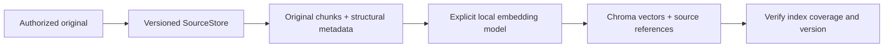
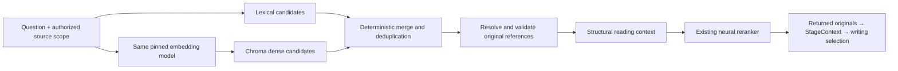

# Chroma in EvidenceAlpha: research and recommendation

2026-09-12. Official documentation research plus current code inspection. No
installation, database opening/migration, embedding inference or benchmark run.
Recommendation, not an implemented or evaluated retrieval change.

## Decision

Recommend local Chroma as a versioned dense candidate index, alongside lexical
retrieval. Preserve SourceStore as the authoritative original evidence store and
retain structural reading, contextual reranking, handoff and rubric review.
Adding Chroma changes candidate discovery; it does not by itself prove better
retrieval or solve parsing, qualifiers, evidence selection or report review.

The current candidate scorer requires lexical overlap before neural reranking.
A reranker cannot rescue a passage excluded at that step. Dense retrieval offers
a complementary way to nominate passages whose language differs from the query.
This is a reason to test hybrid candidates, not evidence that they will recover
all previously missed support. Earlier retirement was not a demonstrated verdict
against Chroma quality.

## Official findings

- Chroma supports dense nearest-neighbor `query`, exact/filter-based `get`, and
  metadata/document filtering. Query vectors must match collection dimensions.
  [Query and Get](https://docs.trychroma.com/docs/querying-collections/query-and-get).
- It can store documents with vectors, or vectors and metadata alone referring to
  externally stored documents. Explicit embeddings avoid re-embedding on insert.
  [Adding Data](https://docs.trychroma.com/docs/collections/add-data).
- The newer hybrid Search API is documented as available for Chroma Cloud, with
  local support future-facing. Do not assume it is available in our local setup.
  [Search API availability](https://docs.trychroma.com/cloud/search-api/overview).
- PersistentClient is a disk-backed local option; the documentation recommends
  server-backed Chroma for production. A local single-owner prototype and a
  deployed multi-user service have different operational requirements.
  [Client reference](https://docs.trychroma.com/reference/python/client).
- Embedding functions are configurable; the default is all-MiniLM-L6-v2. Do not
  accept defaults as a validated Chinese financial/technical embedding choice.
  [Embedding functions](https://docs.trychroma.com/docs/embeddings/embedding-functions).
- Anthropic reports complementary benefits from embeddings, BM25, contextual
  chunk information and reranking in its experiments. Its method adds chunk-
  specific context, not a single partial document summary to every chunk. Those
  results motivate evaluation, not a transferable performance guarantee here.
  [Contextual Retrieval](https://www.anthropic.com/engineering/contextual-retrieval).

Our current lexical scorer is token-overlap scoring, not BM25. Local `where_document`
filtering is not a replacement for ranked BM25 retrieval. Keep these distinctions
explicit when describing an eventual hybrid path.

## Storage without a second evidence authority

| Store | Responsibility |
| --- | --- |
| Filesystem SourceStore | Original bytes, canonical text, structure/spans, source identity, dates and hashes |
| Chroma | Chunk-level vectors, stable IDs, source-version links and small query/filter metadata |
| Existing stage artifacts | Research answers, original-evidence selections, review findings, actual requests and traces |
| Existing ledger | Admissions and usage |

Initially store vectors and metadata in Chroma; resolve returned IDs against
SourceStore before reading or citation. No need to duplicate full PDFs, answers,
report drafts or stage ledgers there. If storing chunk text later provides a
measured need, treat it as a rebuildable index copy with a text hash, never a
competing editable original. Generated summaries stay explicitly non-evidence.

Index identity must include corpus/source versions, parser/chunker versions,
embedding model/revision, dimensions, normalization, input construction and metric.
Matching dimensions alone does not prove embedding compatibility. Store stable
chunk IDs and content hashes. Verify count/ID coverage and index manifest before
activating a completed build. Partial or incompatible builds are not ready; preserve
old indexes and fail clearly rather than silently mixing them. Scope filters must
apply before candidate selection so unapproved sources cannot consume recall or
enter outputs.

## Proposed subsystem flows

Use application-level merging for local deployment. Rank-based fusion is a
reasonable initial choice; freeze its parameters and tie-breaking before an
evaluation. Do not add raw lexical scores to vector distances or assume they are
comparable. Retain candidate origin and both ranks in existing retrieval traces.
Keep total reranking workload controlled for a fair comparison; decide merge and
candidate allocations explicitly, not from known expected answers.

The current BGE reranker is not the selected dense embedding model. Inspect
installed embedding assets and their version/input contracts separately before
choosing one. Do not auto-download a default or silently introduce external
embedding calls. Reuse old Chroma vectors only if all signatures and current
source/chunk bindings match; otherwise build an additive index from current
originals. Do not open the historical database with a newer client that may migrate
it merely to inspect compatibility; use preserved metadata or a copied snapshot.

## Studio and validation implications

Show source index state, collection/version, embedding settings, indexed/missing
chunk counts, and build/query timing. Expand queries into lexical/dense candidates,
merge, original reading blocks, reranking and writing selection. No second Studio
copy of vectors or evidence; link existing IDs and traces.

Validate deterministic index bindings/filtering, duplicate insertion handling,
incomplete builds and evidence preservation first. Then a separately admitted
comparison should assess candidate coverage, returned relevance, complete context,
latency/RSS and downstream evidence survival separately. Include held-out queries;
previously examined failures are regressions. Preserve the frozen 9-pass/7-partial
benchmark and its criteria; new results have their own version and status.

Do not replace the active candidate path on a plumbing pass alone. Promotion needs
measured complementary recall without material evidence-integrity regression and
acceptable resource cost. If dense candidates add no useful support, retain the
working path and document that result rather than claiming Chroma is an upgrade
because it is a database.

## Correction to earlier explanation

Current `retrieval.py` matches query tokens against original passage text **plus
optional generated source context**. Its reranker receives original structural
context. The earlier claim that generated context did not participate in lexical
matching was incorrect; the Studio plan has been corrected. Source context remains
optional, can describe partial input, and is not original evidence.
